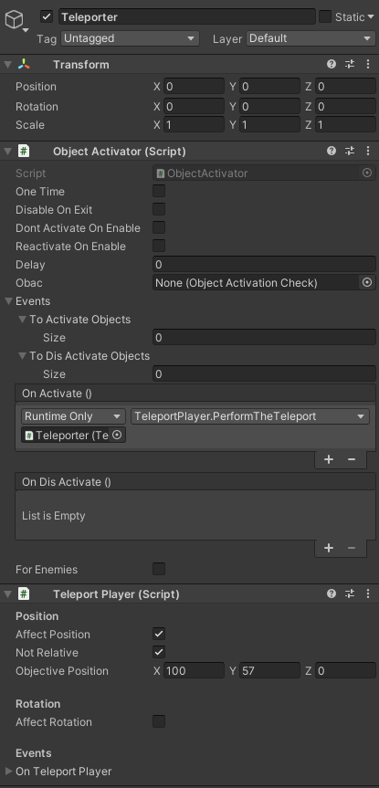
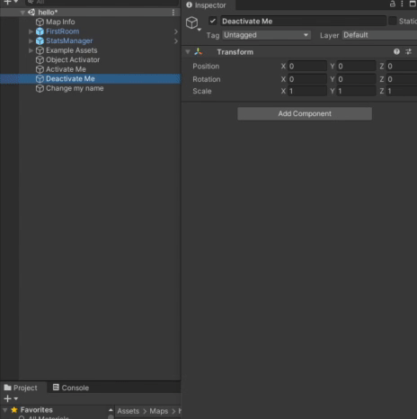

# ULTRAKILL Event
ULTRAKILL Events are a list of Game Objects to activate or deactivate and events to run on Activate and on Deactivate.

They are not a seperate component, but they are used by other components to run custom events when something happens.

## To Activate Objects, To Dis Activate Objects
When this ULTRAKILL Event is triggered, the objects in the first list will become active, while Game Objects in the other list become inactive.

## OnActivate()
Here, you can create custom behaviours by running methods on already existing components.

First, you have to click on the `+` icon to create a new entry.

You then have to select a Game Object that has your desired function you want to use. (You can use the same Game Object your ULTRAKILL Event is on.)

Finally, it will let you select a function to run when the ULTRAKILL Event is triggered.

This is an example where the Player gets teleported when the [Object Activator](../components/object-activator.md)'s ULTRAKILL Event is triggered.

## On Dis Activate()
This part of ULTRAKILL Event is rarely used.

Components that have a "deactivation part" (for example leaving an ObjectActivator's trigger with Disable On Exit set to true) runs these events.

Notably used in:
- [Object Activator](../components/object-activator.md)
- Variable Watchers

:::tip

Lists and Unity Events allow you to Drag and Drop Objects!

:::