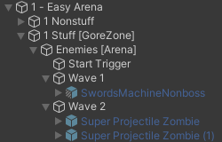
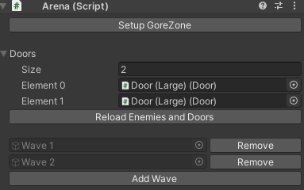
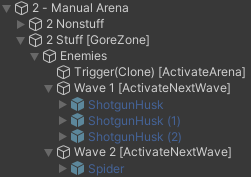
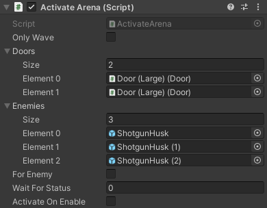
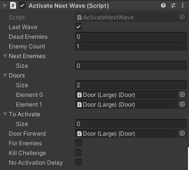
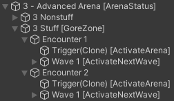

# Arenas

It's not unreasonable to assume that a typical ULTRAKILL level will have enemies in it. This guide will detail how arenas work, in detail.

This guide will result in the following example level: [(View on YouTube)](https://www.youtube.com/watch?v=P-nHb5Qgy7M)

<iframe width="560" height="315" src="https://www.youtube-nocookie.com/embed/P-nHb5Qgy7M" title="YouTube video player" frameborder="0" allow="accelerometer; autoplay; clipboard-write; encrypted-media; gyroscope; picture-in-picture; web-share" allowfullscreen></iframe>

## Simple Arena Setup

The simplest way to create an arena is with the `Arena` helper component.

**You should have a room structure like the following:** (see: [Checkpoints](checkpoints.md))

- `1 - Easy Arena`
- - `1 Nonstuff`
- - - Your level geometry and lights will go here...
- - `1 Stuff` (this should have a `GoreZone` on it)
- - - `Enemies`

**`Enemies` should have an `Arena` component on it.** This is a helper component that automates a lot of arena creation.

(If you didn't add a `GoreZone` before, click *Setup GoreZone* now, which will add one to the GameObject `Arena` is on.)

**Now click *Create Start Trigger*.** This will create a trigger that will activate the arena. Place it wherever you would like to activate the arena.

**Add the doors surrounding your arena to *Doors*.** This will make the Arena lock them when it starts, and unlock them when it ends.

:::tip

Remember to also list your doors in any relevant [checkpoints](checkpoints.md) so the player doesn't get locked out if they respawn!

:::

**Now click *Add Wave*.** This will add a new wave. You may need to manually add an `ActivateNextWave` component to get it to show up in the `Arena` UI; don't worry about the settings for now.

**Add your enemy prefabs under the new wave.** Feel free to have as many waves as you want, though a general rule of thumb is two waves per arena. This is just a guideline, though.

Once you have all of your enemies listed under the waves, **go back to the `Arena` and click *Reload Enemies and Doors*.** This will make it so that the start trigger and every wave correctly spawns the next set of enemies.

There are two more things to do:

1. **Go to each wave and set the *Enemy Count* to the correct amount of enemies under the wave.** If you get this wrong, the wave will end too early or will never end.
2. (Optional) **Go to the last wave and set the *Door Forward*.** This door will open when the wave is over, quickly signifying the direction of progression.

When you are finished, your hierarchy should look something like this:

And your `Arena` something like this:

## Manual Arena Setup

Sometimes, the easy arena setup is simply not flexible enough for advanced usage. In such cases, it's better to create an arena setup manually.

**Create a hierarchy like the following:**

- `2 - Manual Arena`
- - `2 Nonstuff`
- - - Your level geometry and lights will go here...
- - `2 Stuff` (this should have a `GoreZone` on it)
- - - `Enemies`

This time, `Enemies` is simply a blank GameObject for organization.

**Under `Enemies`, you should have a trigger box with the `ActivateArena` component on it.** This will be your arena start trigger. Don't worry about the settings for now.

**Now, create as many waves as you want, each with `ActivateNextWave` on it. Set the *Enemy Count* as per the previous example.**

Now comes the somewhat tedious part: **For every wave, make the *previous* wave spawn the current wave's enemies.** For example, add Wave 2's enemies to Wave 1's *Next Enemies* list, and Wave 1's to the Start Trigger's.

**List the doors surrounding your Arena both in the Start Trigger's and the final Wave's *Doors* arrays.**

**In the final wave, check the *Last Wave* box and (optionally) set the *Door Forward*.**

:::tip

Enemies spawn immediately when activated by any means. While `Arena` automatically deactivates all of it's child enemies, the manual setup will not. You must deactivate the enemies by hand before exporting, otherwise they will spawn immediately when the room loads.

You can also intentionally leave enemies activated. For example, P-2 does this with idols, which are always present and don't have a spawn effect.

:::

When you are finished, your hierarchy should look something like this:

Your start trigger should look something like this:

And the final wave should look something like this:

## ArenaStatus

Sometimes, you want multiple arenas in the same room. Perhaps you're creating a non-linear level, and want a different encounter on the return trip. In such cases, `ArenaStatus` will help.

In this example, we're going to have two encounters in the same room: one on first entering the room, and another activated by a condition.

**Create a hierarchy like the following:**

- `3 - Advanced Arena`
- - `3 Nonstuff`
- - - Your level geometry and lights will go here...
- - `3 Stuff` (this should have a `GoreZone` on it)
- - - `Encounter 1`
- - - `Encounter 2`

**Create both encounters using the Manual Setup detailed above.**

Encounter 1 will run normally on entering the room, and doesn't need any further changes.

To create an alternative encounter that activates on a condition, **first add an `ArenaStatus` component to the top-level Room Object, `3 - Advanced Arena` in this case.**

**Open Encounter 2's Start Trigger and set *Wait For Status* to 1.**

Now, create something that will change the `ArenaStatus`. Skull Pedestals have a *Arena Statuses* field, which is what is used in the example.

And... that's it! Now encounter 1 should run when first entering the room, and then encounter 2 should run upon returning to the room after triggering something (e.g. a skull placement).

You should have a hierarchy like the following:

## Miscellaneous tips

- `DeathMarker` is a component that allows you to bump an ActivateNextWave's enemy count, same as an enemy death would. Simply add it to a GameObject, then activate the GameObject. This is useful for more complicated arena setups where an enemy survives across waves, for instance.
- You can have multiple `ActivateNextWaves` on the same object, which can be useful if you want to trigger something when a certain number of enemies die and another thing when more enemies die.
- `ActivateNextWave` has a *To Activate* field to activate objects once the wave ends, useful for e.g. FinalRoom's `FinalDoorOpener`.
