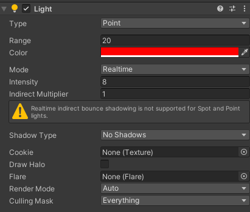
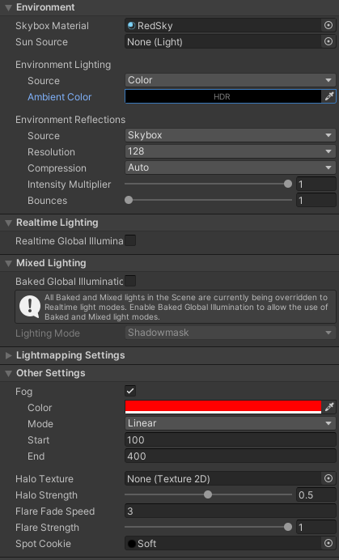
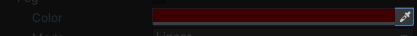

# Lights
Due to the way Lights work in ULTRAKILL, there may be some precautions you must take.

This page also serves as a general guide for Light Sources.

[Unity Docs](https://docs.unity3d.com/Manual/class-Light.html)

:::danger

An object may only be lit up by **8** light sources at once! Anything more than that will cause flickering.

:::

## The Light Object

- `Type`
  - `Point Light` is the most common one you need. It emits light in all directions from its position.
  - `Spotlight` emits in the forward direction. You'll need to rotate it to orient it in the way you want.
  - `Directional` Light is a sun-like light source. It illuminates all faces at the angle its rotated at. Directional Light's position is irrelevant, it's only the rotation that matters.
  - More specific information on [Unity Docs](https://docs.unity3d.com/550/Documentation/Manual/Lighting.html) with pictures.
- `Range` - At which distance should the light fully fade off. Higher `range` also makes the light brighter closer to the center.
- `Intensity` - How bright the light should be. Usually in ULTRAKILL's case, it'll usually be in the 4-10 range.
- `Culling Mask` - This specifies what [layers](../important/layers-and-tags) should the Light Source illuminate. This allows you to create seperate Light Sources so they don't leak into each other for example indoors and outdoors area.

Any other setting is irrelevant in ULTRAKILL's case. ULTRAKILL does not support shadows or light baking.

## Lighting Settings

To open up the Light Settings, navigate to it like so: `Window > Rendering > Lighting Settings`

[Unity Docs](https://docs.unity3d.com/Manual/lighting-window.html)

:::danger

Do **not** press `Generate Lights`. PSX Shaders do **not** support baking lights.

:::

### Environment
- `Skybox Material` is the Skybox that shows up on your level.
  - Make sure `Render Skybox` is enabled on your [MapInfo](../important/map-setup#map-info) Game Object.

- `Environment Lighting` - Ambient color of the level. All objects are lit by the given color.
  - `Skybox` adjusts the color automatically on the given Skybox.
  - `Gradient` smoothly blends between 3 colors.
  - `Color` is a single color of ambient light. White results in a full bright level, black results in a pitch dark level which has to be lit up by multiple Light Sources.

### Other Settings (Fog)
Fog is off by default. Enabling it will make far away objects fade into the selected color.

- `Color` is the color to finally fade into.
- `Mode` is the type of curve to use for fading. `Linear` is the best and easiest to use.
- `Start` is the distance where objects will start fading. Any objects below this distance are fully visible.
- `End` is the distance where the object is fully faded, and has the specified `Color`.

:::tip

For setting the `Fog Color`, click the `eyedropper icon` to the right, and click on the Skybox texture. This will ensure far away objects will blend into the skybox perfectly.

When clicking the `eyedrop dropper` icon, you can pick colors from **anywhere**, even other applications.

:::