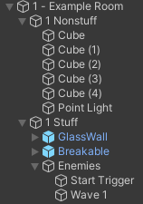
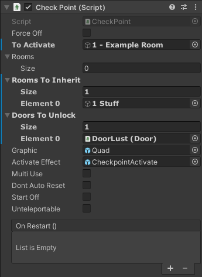

# Checkpoints

**Checkpoints** come in two types:

- **Non-reusable** (`Normal Prefabs/Levels/Checkpoint.prefab`): Checkpoints that are one-and-done. This is the most common type.
- **Reusable** (`Normal Prefabs/Levels/CheckpointReusable.prefab`): Checkpoints that can be reused multiple times, as used extensively in 4-2 for example.

Both work fairly similarly, though there is a fair bit of special setup required to get them to work.

:::tip

Everyone does checkpoints and room structure slightly differently.

The following is approximately the way the base game's levels do them, but feel free to experiment.

As a side note, **naming convention** is the least important bit of this documentation, and pretty much all GameObject names are just suggestions.

:::

## Room Setup

Your level **should be separated into rooms** (see: [Optimization](../guides/optimization.md)), typically each room only having one enemy arena in it.

The base game names topmost room GameObjects with the pattern `X - Name`. The examples below will use `1 - Example Room`.

`1 - Example Room` should contain two blank GameObjects as children:

1. `1 Nonstuff`: **This is where everything that doesn't need to be saved by checkpoints goes**, so most of your level geometry and lights.
2. `1 Stuff`: This is where everything that can move, spawn, be broken, etc. goes. **Everything under here will be reset by checkpoints.**

**`1 Stuff` should have a `Gore Zone` component.** Anything that can produce gore or can be broken needs a GoreZone to reset properly.
The exact location often does not matter (it just needs to be a parent, grandparent, etc of enemies and such), but this is a very convenient place to put it.

## Checkpoint Setup

**Checkpoints must be unparented**. Do not put them in their containing room.

**Set `To Activate` to the room that contains the checkpoint.** This room will be activated when reloading.

**`Rooms` and `Rooms To Inherit` should be lists of `X - Stuff` GameObjects.** These will be saved and restored by the checkpoint.

**Atleast one thing must be in either `Rooms` or `Rooms To Inherit`, otherwise the player will respawn into the void.**

The difference between the two is when the save happens:

- `Rooms`: Everything in `Rooms` is saved **immediately upon level load**. Use this for stuff that can't possibly be affected before hitting the checkpoint. Reusable checkpoints likely won't make much use of `Rooms`.
- `Rooms To Inherit`: Everything in `Rooms To Inherit` is saved **when the checkpoint is hit**. Use this for... most stuff, really.

**Set `Doors To Unlock` to unlock any doors to enemy arenas where you could have reloaded the checkpoint.** Otherwise, the checkpoint isn't going to do much good if you can't get back to where you died.

