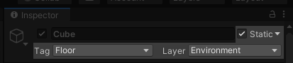
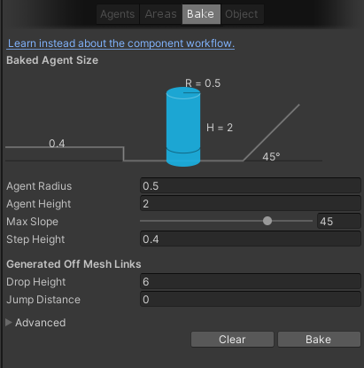
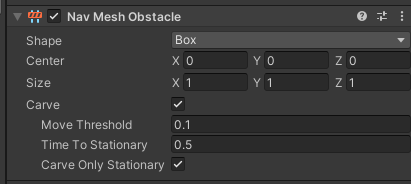
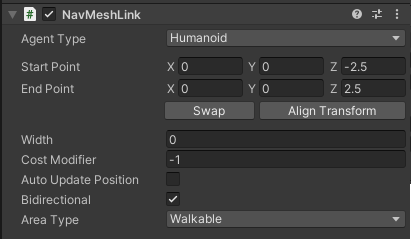

# NavMesh

Only Navigation static objects are included in the Navmesh bake, which is used by enemies.

[Unity Docs](https://docs.unity3d.com/Manual/nav-BuildingNavMesh.html)

## Preparing for NavMesh
First make sure your objects are layered and tagged properly and they're marked as static.

Layer and tag is as crucial as marking the object as static; without it, enemies won't be able to walk on said object, regardless of if it's baked or not.

See [Layers and Tags](layers-and-tags) for more information.

:::info

NavMeshes are baked based on **Mesh Renderer**, and **not** colliders!

If you want to make an alternate AI path or block off one, make sure the object doesn't have a collider, and tag it as EditorOnly so it doesn't appear in game.

:::

After the NavMesh is ready to be baked, open up the Navigation tab at **Window > AI > Navigation**, and press the Bake button at top.

To bake, simply press the `Bake` button below. Default settings are usually good enough.

## NavMesh Settings

Most of the settings should be left on default, although if you find that your AI can't walk on a path you want them to, feel free to adjust them.

- `Agent Radius` - Each AI Unit is given a cylinder shape which they use to collide with walls, or see if they fit in holes. It is best left on default.
- `Agent Height` - Similar reason as radius, except this parameter adjusts the cylinder hitbox's height.
- `Max Slope` - This is the max angle the AI can walk on. Increasing it will allow the unit to walk on steeper terrain.
- `Step Height` - Similar to climbstep, if the AI were to walk to a higher ground, this is the maximum distance that can elapse between the two ground.
- `Drop Height` - This is similar to *Step Height*, however, this is from Higher to Lower ground. You will usually want to adjust this value so enemies can jump down from higher grounds.
- `Jump Distance` - Units are able to jump across gaps that are shorter than the given distance.

## NavMesh Obstacles (Influencing NavMesh at Runtime)
NavMeshObstacle are components that can block off paths of enemies.

[Unity Docs](https://docs.unity3d.com/Manual/class-NavMeshObstacle.html)

:::info

NavMeshObstacles only support two kinds of shapes: Box and Capsule.

:::

- `Carve`
   - If the object is moving, carve should be off. Agents will try to steer to avoid collision.
   - If the object is stationary, carve should be on. It will create a hole in the NavMesh and Agents won't be able to go inside that area.
- `Move Threshold` - If the object moves, it will update the "Hole in the NavMesh" everytime it moves more than the given distance.
- `Time To Stationary` - The required amount of time for the Carve to be treated stationary. (See below setting)
- `Carve Only Stationary` - Enables the `Carve` setting when stationary, otherwise disables it if moving automatically.

## NavMesh Link (Create traversable gaps)
NaveshLink lets you create traversable paths or gaps at runtime.

[Unity Docs](https://docs.unity3d.com/560/Documentation/Manual/class-NavMeshLink.html)

- `Agent Type` - Obselete in ULTRAKILL's case, as all enemies share the same Agent Type.
- `Start Point`, `End Point` - Defines the position from where to where can the agents traverse.
- `Width` - Width of the path. If set to 0, enemies must reach the exact Points.
- `Cost Modifier` - How convenient is this path compared to other paths. Example, AI may prefer jumping rather than walking around the gap if the value is negative.
- `Bidirectional` - If disabled, Agents can only traverse from Start Point to End Point.
- `Area Type` - What type of Agents can this path be used by. Example if Area Type is "Jump" but the AI can't traverse "Jump" area, they will simply ignore it.