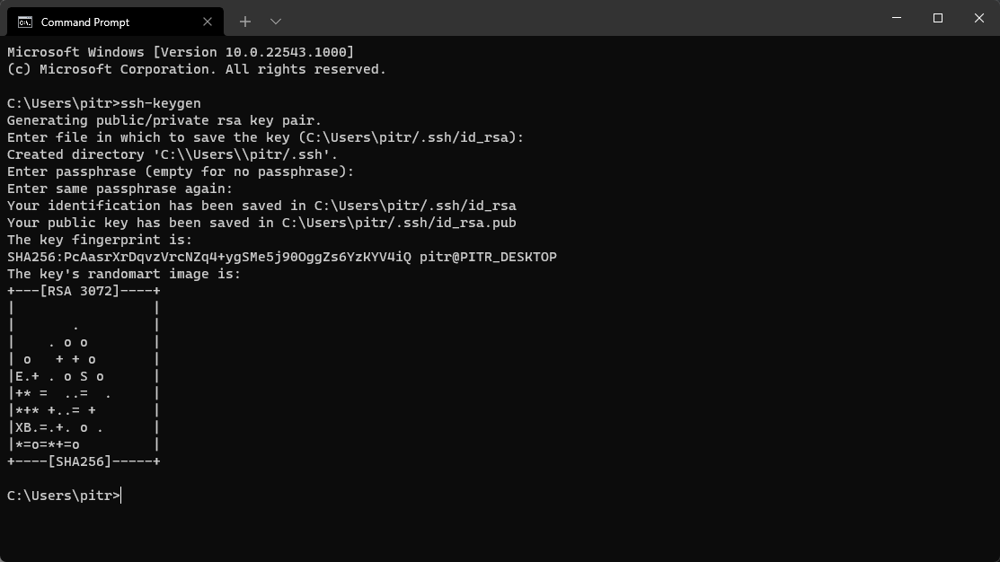

# Beta Prerequisites

## Creating a GitHub account

If you don't have a GitHub account, you can create one [here](https://github.com/join).

## Installing Git

If you don't have Git installed, you can download it [here](https://git-scm.com/downloads).

Make sure that the Git LFS box is checked during the installation.

## Creating an ssh key

If you don't have an ssh key, you should create one right now. [Guide](https://docs.gitlab.com/ee/ssh/#generate-an-ssh-key-pair)

:::info

Your key **CANNOT** have a passphrase. If it does, you will have to remove it and create a new one.

:::

Open the command prompt and type: `ssh-keygen`

The default settings should be fine, so feel free to keep pressing enter.

## Adding the ssh key to your account

Copy the contents of the `id_rsa.pub` file into your clipboard.

By default, it should be in the `.ssh` folder located in your user directory.

Next, go to this [GitHub Add SSH Key Page](https://github.com/settings/ssh/new) and paste the contents of the `id_rsa.pub` file into the `Key` field and click `Add SSH key`

## Joining the testers GitHub organization

As of now, all the repositories needed for Tundra are private. You will have to be manually added to the testers organization, so please share your GitHub username on the Tundra Discord server.

Otherwise you will be unable to proceed.

## Setting up Tundra

[Tundra Quick Start](editor-setup)
