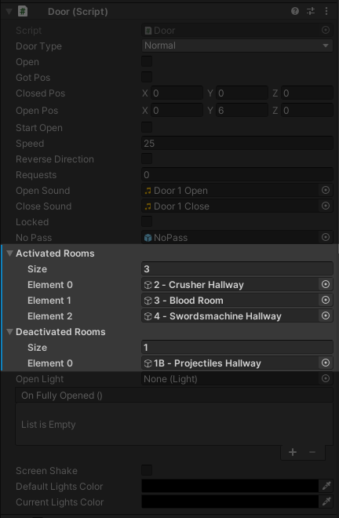
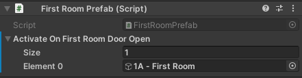

# Optimization

Bigger maps need some help from you to run smoothly.

## Disabling Rooms

This technique is used in every stock ULTRAKILL map. It works by keeping all rooms disabled and only enabling them when a neighboring door opens.

Level 0-2 in the editor.

An example door component configured to disable and enable certain rooms.

The [FirstRoom](setup?id=first-room) prefab configured to enable the first actual room before opening the main door.

