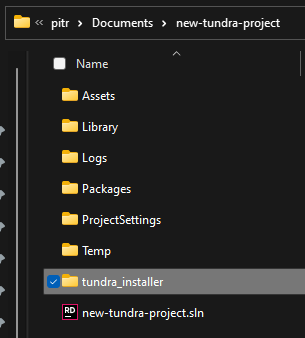

# Quick start

## Getting Unity

If you don't have Unity already installed, go and install [Unity Hub](https://unity3d.com/get-unity/download).
You might have to create a Unity account and choose the personal license.

After that you will have to [install Unity 2019.4.16f](unityhub://2019.4.16f1/e05b6e02d63e). You don't need any dev tools, platform support or documentation so feel free to uncheck all the boxes.

Also, it might be useful to learn the [Unity essentials](https://unity3d.com/learn/tutorials/topics/interface-essentials/interface-overview) if you have never used Unity.

## Getting Tundra

At this point in time, Tundra isn't publicly available. Contact [PITR](https://pitr.dev/contact) via the Discord server you should already be in.

After setting up your GitLab account and installing git, create a new 3D Unity project with the correct version of Unity.

Next, download the [Tundra Installer](https://github.com/PITR-DEV/Tundra-Installer/releases/latest) and unzip it in the root of your new project.

> Note: If you're viewing this during the private beta, the download link is likely to be broken.
> In that case, you must obtain the latest installer from the tundra group on Discord.

## Setup

Close Unity and start the `install_prereq.bat` if you haven't already.

> Make sure you already have the Agony version of the game installed, before running the installer.

Follow the steps from the script, and then launch the installer.

## Creating a new map

Using Quick New Map allows you to mostly skip the [Map Setup](/setup), though you still have to fill out your map details!
