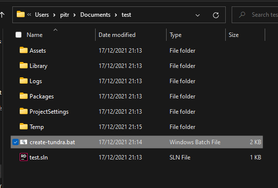
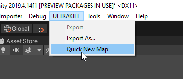
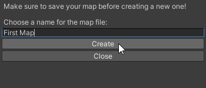

# Quick start

## Getting Unity

If you don't have Unity already installed, go and install [Unity Hub](https://unity3d.com/get-unity/download).
You might have to create a Unity account and choose the personal license.

After that you will have to [install Unity 2019.4.16f](unityhub://2019.4.16f1/e05b6e02d63e). You don't need any dev tools, platform support or documentation so feel free to uncheck all the boxes.

Also, it might be useful to learn the [Unity essentials](https://unity3d.com/learn/tutorials/topics/interface-essentials/interface-overview) if you have never used Unity.

## Getting Tundra

At this point in time, Tundra isn't publicly available. Contact [PITR](https://pitr.dev/).

After setting up your GitLab account and installing git, create a new 3D Unity project with the correct version of Unity.

Next, download the [Tundra Setup Script](https://gitlab.com/PITR_DEV/tundra.config/-/raw/master/Scripts/create-tundra.bat?inline=false) and place it in the root of your new Unity project.

Close Unity and start the script.

[tundra installation video](https://www.youtube-nocookie.com/embed/EOo4OL4kiYw?controls=1 ':include :type=iframe width=560px height=515px frameborder="1" allow="accelerometer; clipboard-write; encrypted-media; gyroscope; picture-in-picture" allowfullscreen')

## Creating a new map

Using Quick New Map allows you to mostly skip the [Map Setup](/setup), though you still have to fill out your map details!
